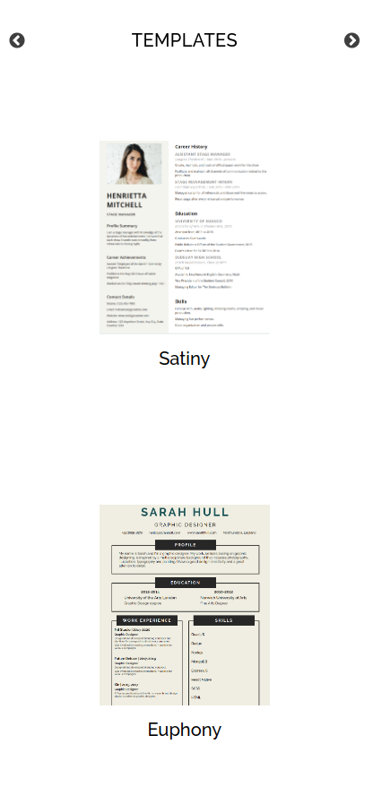
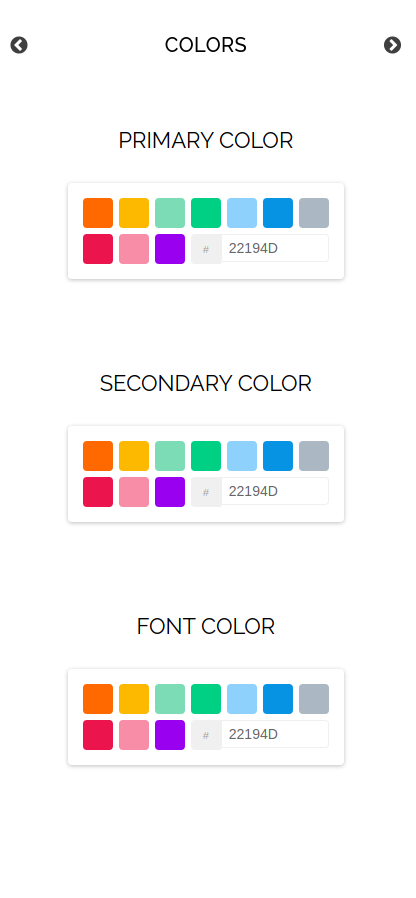
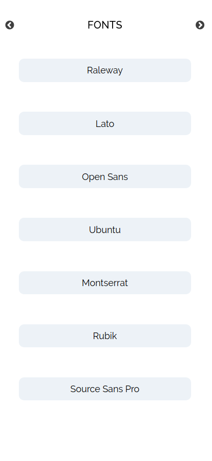
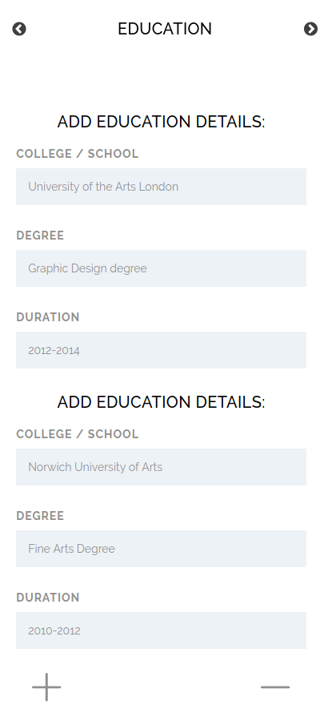
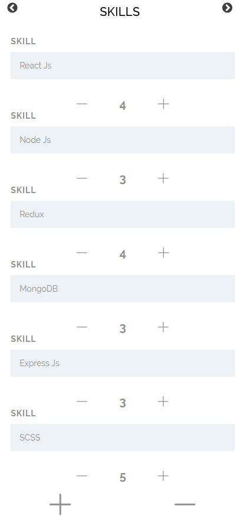
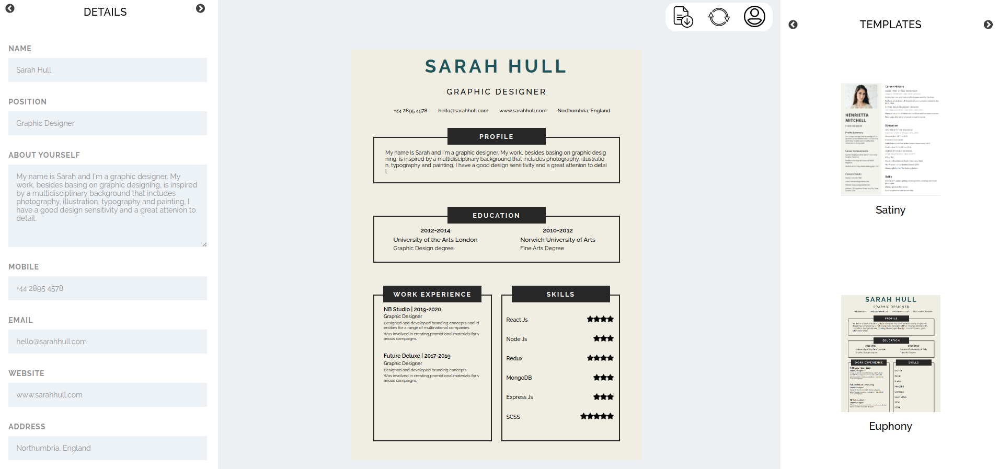

# ProResume

### Deployed at: https://proresume.netlify.com

### The only resume builder you need to make your resumes on the go. Its completely free to make and download the resume!
### Built using react.js and redux. It also uses redux-persist for data persistence, so you can come back and continue from wherever you left

### It is highly customisable as you can choose from variety of templates, add your own colors to them and even choose your own font styles. Currently, there are two templates, will be adding more soon!

   

### Fill all the details and create your resume!

   

### Currently, its resposive only for desktop view!

### Web View:

